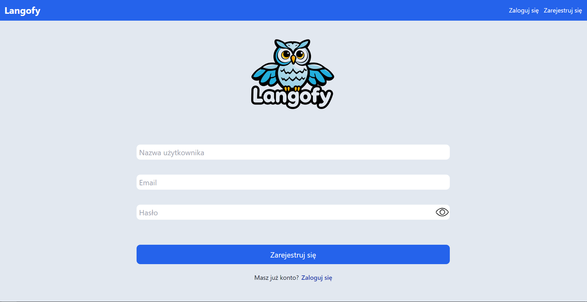
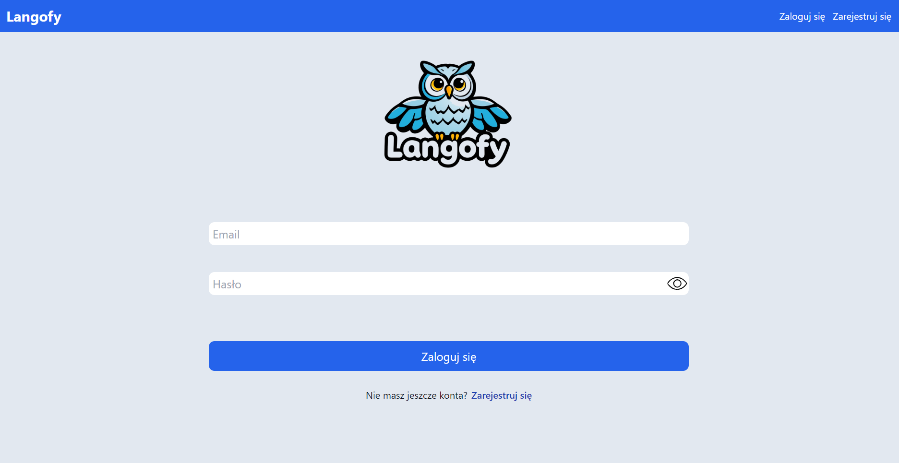
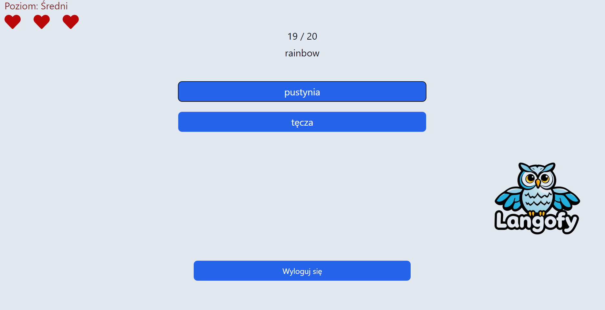
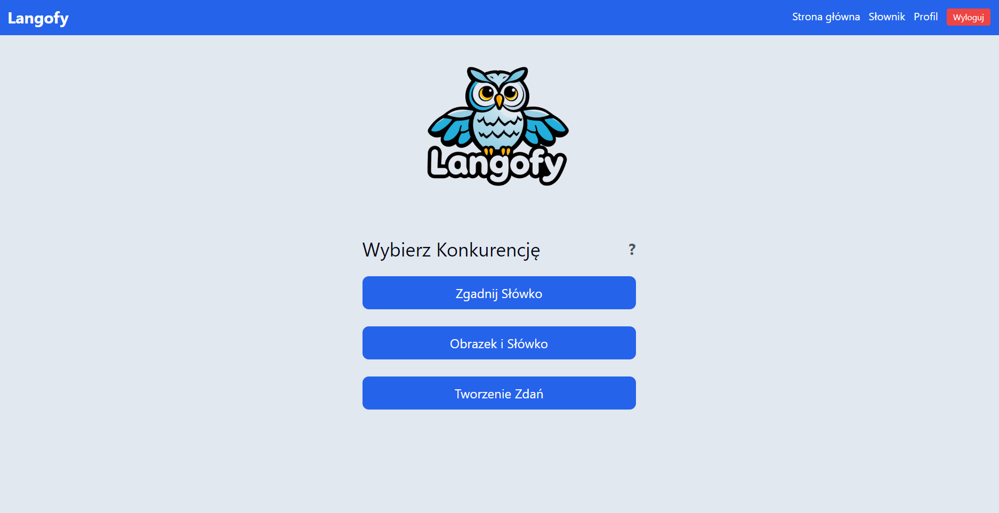
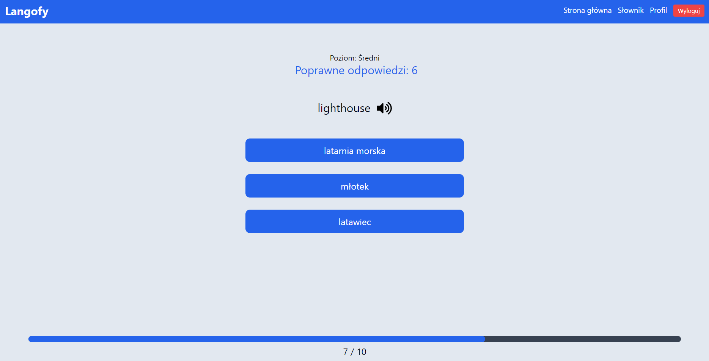
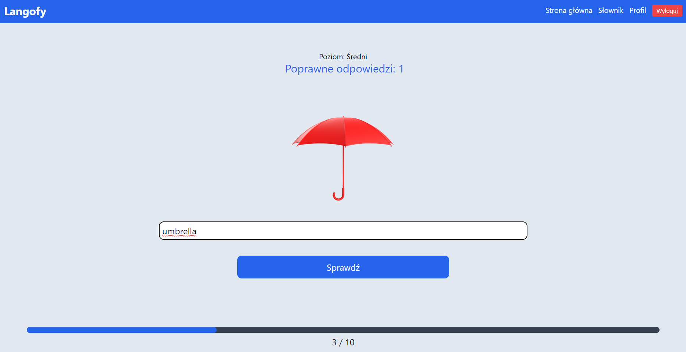
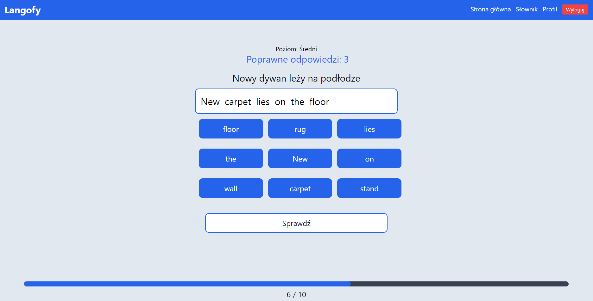
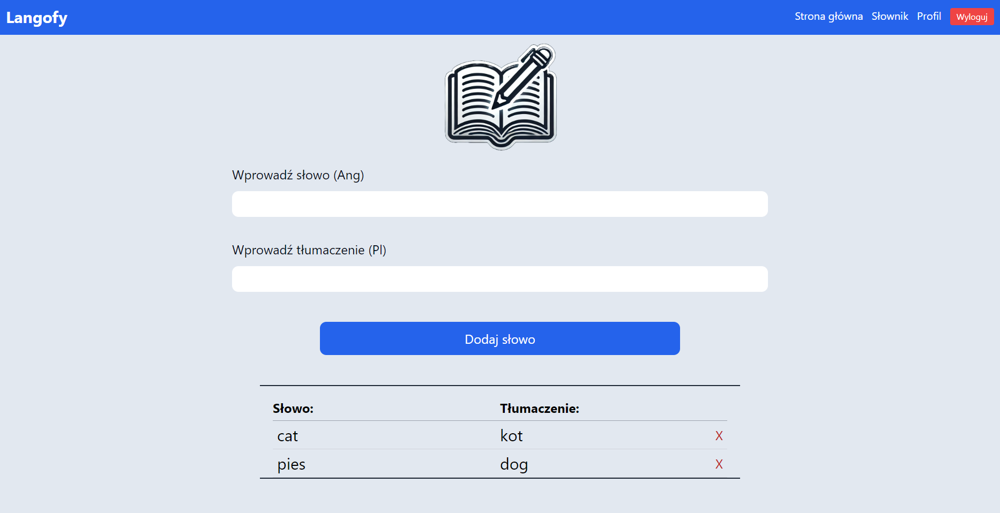
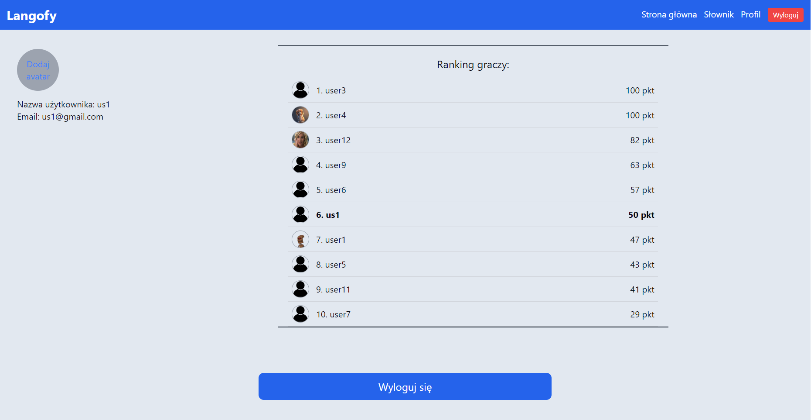

# **Langofy – Web Version**

This is a **web version** of my original **mobile application** - **https://github.com/matwid03/langofy-mobile** designed for children to learn English through interactive educational games. The project was originally built using **React Native** and later adapted with **React** for the web to provide learning experience on larger screens.

## **Features**

### 🔹 **User Login and Registration**
The app allows users to register and log in to their account. Authentication and storing user data, including vocabulary, are managed using Firebase.

### 🔹 **Personalized Difficulty Level**
Upon the first login, users take a test to determine their appropriate level of difficulty. The test helps tailor the app to the child’s proficiency, ensuring an effective learning experience.

### 🔹 **Educational Games**
The application offers **three interactive games** to help users learn English:

1. **Matching English Words to Polish Words**  
  The user must match English words to their Polish equivalents. Additionally, users can listen to the correct pronunciation of the English word to help improve their listening and pronunciation skills.

2. **Matching English Words to Images**  
  The user matches English words to the appropriate images, reinforcing vocabulary comprehension and memorization.

3. **Building Sentences from Random Words**  
   The user arranges randomly selected words into a grammatically correct sentence, helping to develop sentence-building skills.

### 🔹 **Custom Vocabulary**
Users have the ability to add their own words to their vocabulary list. This feature allows children to expand their learning by including words that are relevant to their interests, making the learning experience more personalized and engaging.

### 🔹 **User Profile & Leaderboard**
The app provides access to the user’s profile, where they can view their information, log out, and track their progress. The profile also displays a player ranking, showing the scores of other users based on points earned in the games.

## **Development & Technology Stack**
- Built using **React and React-router-dom** for web-based navigation.
- Firebase integration for **authentication and database management**.
- Styled with **Tailwind CSS** for a responsive and modern UI.
- Originally developed as a **React Native mobile app**, later adapted for web use.

# https://langofy.netlify.app/sign-in #

## **Screenshots**

